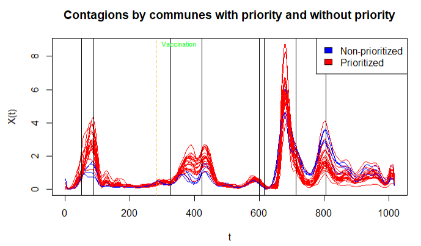
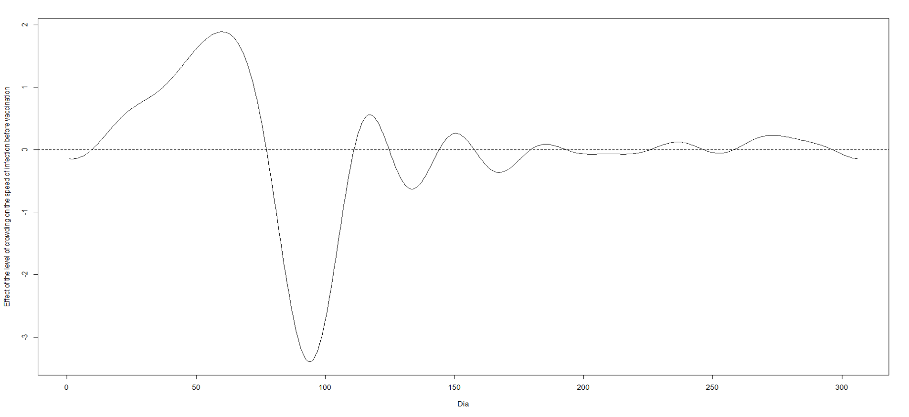
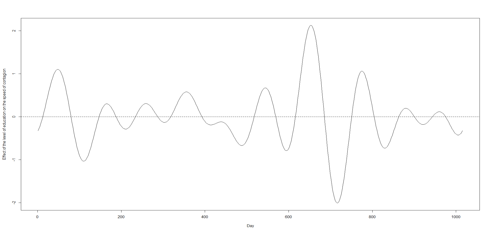
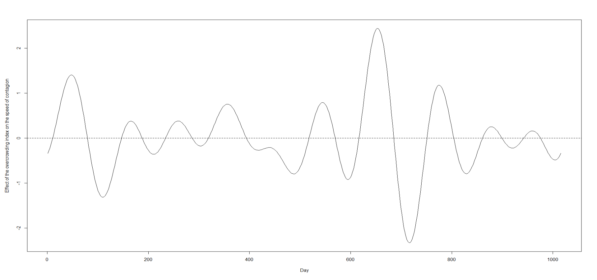
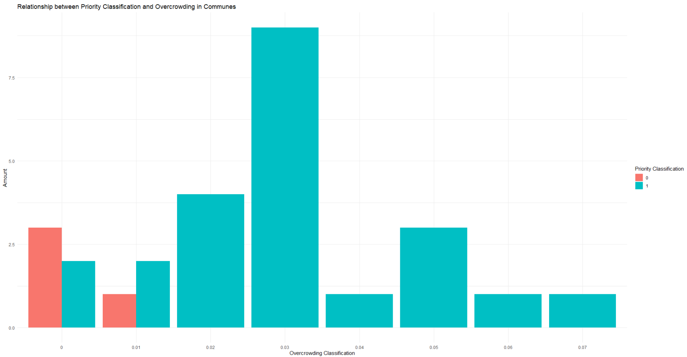
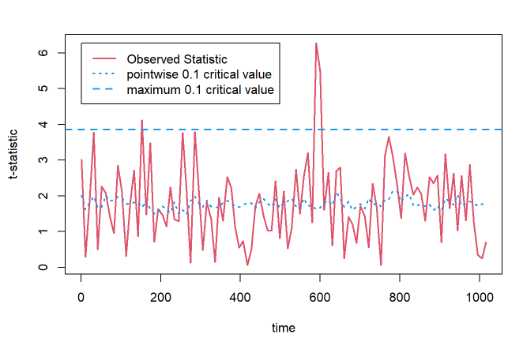
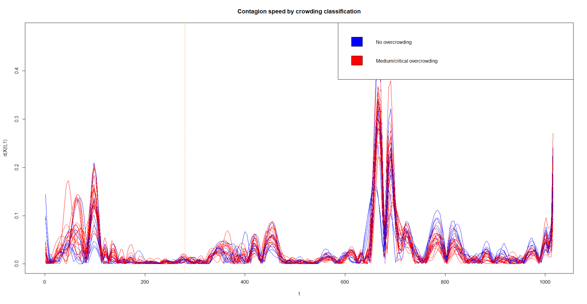

# Exploring the Relationship Between Socioeconomic Status and COVID-19 Contagion Rates in Santiago, Chile

## Description

This project aims to analyze the correlation between COVID-19 infection rates and various socioeconomic factors in Santiago, Chile, from 2020 to 2022. The study focuses on understanding how housing conditions, education levels, and other relevant variables influence the speed and spread of COVID-19 across different communes in the city.

By leveraging advanced functional data analysis techniques and comprehensive datasets, the project seeks to provide valuable insights into the epidemiological dynamics within Santiago. The findings aim to inform public health policies and interventions, ensuring they are equitable, adaptive, and contextually informed.

## Objectives

### General Objective
To expand upon the analysis presented by Villada & Reyes (2023), exploring correlations between the COVID-19 infection rate and various factors in Santiago, Chile, from 2020 to 2022.

### Specific Objectives
- Collect updated data for the years 2020 to 2022, reflecting housing conditions, education levels, and other relevant factors in Santiago.
- Compile data to calculate the infection rate in each commune of Santiago throughout the pandemic.
- Apply functional data analysis techniques to examine infection rate variations across different communes.
- Investigate the potential relationship between infection rates and socioeconomic variables.
- Use advanced functional analysis techniques to understand the complexities in the dynamics of virus spread.

## Methodology

1. **Data Collection**: Gather updated data from the Pontificia Universidad Católica de Chile, covering 27 communes in Santiago. This includes variables such as overcrowding, housing quality, and access to basic services.
2. **Infection Data**: Calculate the contagion speed by determining the temporal derivative of the infection data.
3. **Functional Data Correlation**: Compute an aggregated index of housing condition variables and correlate it with contagion speeds.
4. **B-Spline Method**: Use B-splines to depict smooth curves for visualizing disease trends.
5. **Functional Regression**: Perform functional regression to analyze the relationship between housing conditions, education levels, and contagion rates.
6. **Significance Testing**: Calculate p-values to determine the significance of overcrowding and education indices concerning contagion speed.

## Key Findings

- Overcrowding significantly influences the COVID-19 contagion rate, with notable impact periods identified around specific days.
- Higher overcrowding indices correlate with increased prioritization and resource allocation.
- Both overcrowding and education levels significantly affect contagion rates, though their impacts vary over time.
- Pre-vaccination data highlights the critical role of housing conditions in early pandemic stages.

## Results

### Contagions by Communes with Priority and without Priority

### Effect of Crowding on Infection Speed before Vaccination

### Effect of Education Level on Infection Speed

### Effect of Overcrowding Index on Infection Speed

### Relationship between Priority Classification and Overcrowding in Communes

### Permutation Test for Infection Speed by Overcrowding

### Infection Speed by Overcrowding Classification

## Conclusions

The functional regression analysis and interpretation of coefficients and p-values indicate that overcrowding has a significant influence on the COVID-19 contagion rate in Santiago, Chile. Specific periods of impact highlight the importance of considering temporal dynamics in public health policy design. The observed variability suggests that interventions must be adaptive and contextually informed to be effective.

The comparative analysis between overcrowding and education levels with the COVID-19 contagion rate reveals that both factors significantly impact contagion rates, though their effects vary over time. Peaks and valleys in both factors' influence suggest that different socio-economic variables interact in complex ways to affect contagion rates. This non-linear relationship indicates the necessity for multifaceted and adaptable intervention strategies.

Segmenting data before vaccination provides a clearer view of the impact of overcrowding without immunization interference, offering valuable information for designing public health policies. The analysis shows that both overcrowding and education level significantly influence the COVID-19 contagion rate, with variations in their impact over time. Both factors show an initial positive relationship with the contagion rate but also present periods of negative relationship, underscoring the need for dynamic and evidence-based public health policies.

## Files

- `Analisi_funcional_final_abril_FINAAL.Rmd`: The R Markdown file containing the functional analysis and all code used in the project.
- `datos_pi2_hacinamiento_final.csv`: The dataset used for the analysis.

## Authors

- **Sara Gallego Villada** - Mathematical Engineering, Universidad EAFIT
- **Nicolás Alberto Moreno Reyes** - Computing and Analytics, School of Applied Sciences and Engineering, Universidad EAFIT

## Acknowledgments

We would like to thank the Pontificia Universidad Católica de Chile for providing the data and resources necessary for this study. Special thanks to our advisors and colleagues for their support and contributions.

